# AI Basketball Referee System Flowcharts

เอกสารนี้สรุป Flowchart ของระบบ AI Basketball Referee ทั้งหมด เพื่อใช้เป็นต้นแบบในการวาด diagram ลงรายงาน, resume, presentation หรือเอกสารโปรเจค

ระบบนี้แบ่งเป็น 6 ส่วนหลัก:

1. Real-time video pipeline
2. Detection layer: person, ball, rim, pose
3. Rule engine: foul detection
4. Pose quality and false-positive guard
5. Replay, event logging, QA review
6. Streamlit UI and analytics

---

## 1. High-Level System Architecture

ภาพรวมระบบตั้งแต่กล้องจนถึง UI และ replay

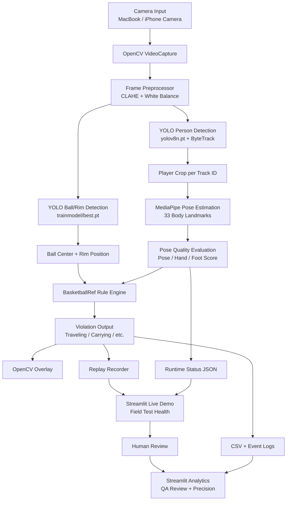

### อธิบายภาพรวม

- `OpenCV VideoCapture` รับภาพจากกล้องจริง
- `FramePreprocessor` ปรับภาพก่อนส่งเข้า model เพื่อลดผลกระทบจากแสง
- `YOLO Person + ByteTrack` ตรวจจับคนและรักษา Player ID
- `YOLO Ball/Rim` ตรวจจับลูกบาสและห่วง
- `MediaPipe Pose` หา keypoints ของผู้เล่นแต่ละคน
- `Pose Quality` เช็กว่า keypoints ชัดพอสำหรับแต่ละ rule หรือไม่
- `BasketballRef` คือ rule engine กลางที่รวมกติกาทั้งหมด
- `Replay Recorder` บันทึกวิดีโอเมื่อพบ foul
- `Streamlit UI` ใช้ดู live status, replay, analytics และ QA review

---

## 2. Real-Time Main Loop Flow

Flow หลักของ `main.py` ในแต่ละ frame

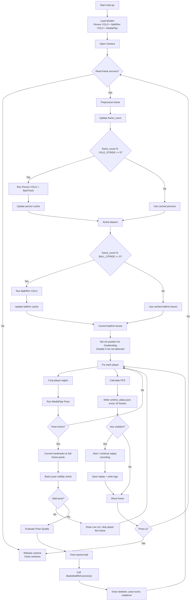

### จุดสำคัญของ main loop

- Person detection ใช้ stride เพื่อลดภาระ CPU/GPU
- Ball/Rim detection ใช้ cache ระหว่าง frame ที่ไม่ได้รัน model
- ถ้าไม่เห็น rim ระบบจะ disable goaltending เพื่อลด false positive
- ถ้า pose ไม่ชัด ระบบจะเขียน `Low vis` แล้ว skip player เฟรมนั้น
- Runtime status ถูกเขียนออกไปที่ `logs/runtime_status.json` เพื่อให้ UI อ่าน

---

## 3. Detection Layer Flow

แยก layer การตรวจจับวัตถุและร่างกาย

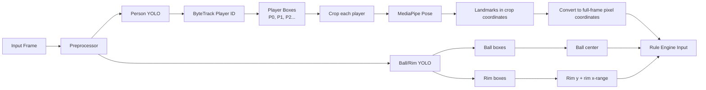

### ข้อมูลที่ส่งเข้า rule engine

| Data | Source | ใช้ทำอะไร |
|---|---|---|
| Player ID | ByteTrack | แยก detector state รายคน |
| Landmarks pixel | MediaPipe Pose | ตรวจมือ เท้า ไหล่ สะโพก |
| Ball box / center | Ball YOLO | ตรวจ dribble, holding, carrying |
| Rim y / x-range | Rim YOLO | ตรวจ goaltending |
| Frame size | OpenCV | ใช้ scale และ boundary |

---

## 4. Pose Quality Gate Flow

ระบบนี้ไม่ได้เชื่อ pose ทุกจุดเท่ากัน แต่แยก score ตาม rule

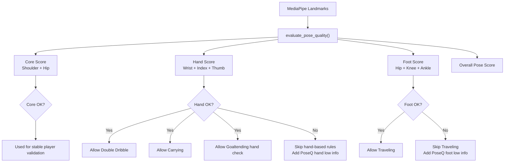

### แนวคิดแบบ Senior AI Engineer

- ไม่ควรใช้ bounding box อย่างเดียว เพราะไม่รู้ตำแหน่งมือ/เท้า
- ไม่ควรใช้ pose แบบผ่าน/ไม่ผ่านทั้งระบบ เพราะแต่ละ rule ใช้ keypoints ไม่เหมือนกัน
- Traveling ต้องการ `foot_score`
- Carrying, Double Dribble, Held Ball ต้องการ `hand_score`
- Held Ball ต้องการ hand score ของผู้เล่นทั้งสองคน
- ถ้า keypoints ไม่ชัด ระบบควร skip rule นั้น ไม่ควรเดา

---

## 5. BasketballRef Rule Engine Flow

Flow ของ `referee.py`

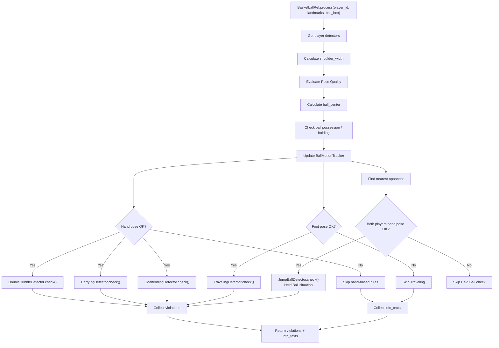

### Detector state ต่อผู้เล่น

แต่ละ `player_id` มี detector ของตัวเอง:

```text
dd   = DoubleDribbleDetector
tr   = TravelingDetector
ca   = CarryingDetector
gt   = GoaltendingDetector
jb   = JumpBallDetector
ball = BallMotionTracker
```

การแยก state รายคนช่วยให้ผู้เล่นหลายคนไม่แชร์สถานะผิดกัน

---

## 6. Ball Motion Tracker Flow

`BallMotionTracker` เป็นข้อมูลกลางที่ช่วยลด false positive

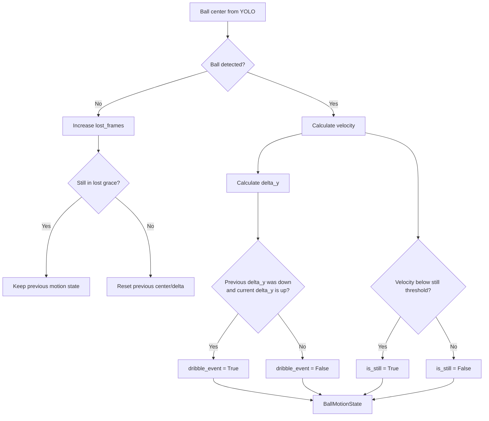

### ใช้ใน rule ไหน

| Field | ใช้กับ | เหตุผล |
|---|---|---|
| `dribble_event` | Traveling | ลด false positive ตอนกำลังเลี้ยงบอลจริง |
| `is_still` | Held Ball | ลูกต้องนิ่งหรือชะลอจริง |
| `velocity` | Carrying / Double Dribble | แยก holding, pass, shot, dribble |
| `lost_frames` | Stability | กันลูกหาย 1-2 เฟรมแล้ว state พัง |

---

## 7. Traveling Flow

ตรวจ Traveling จาก foot-strike + holding + dribble guard

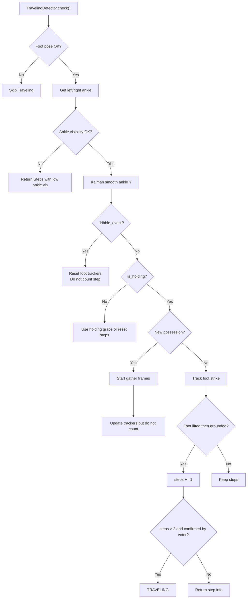

### Key idea

- ไม่ได้นับจาก bounding box
- ใช้ข้อเท้าและ state machine ของเท้า
- ถ้ามี `dribble_event` จะไม่เอาการขยับเท้าเฟรมนั้นไปนับก้าว
- มี gather frame และ holding grace เพื่อกันระบบตัดสินเร็วเกินไป

---

## 8. Double Dribble Flow

ตรวจ Double Dribble ด้วย state machine

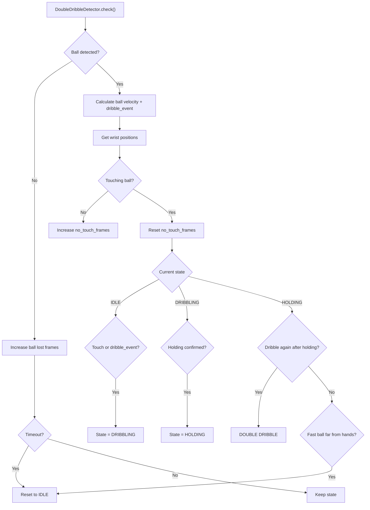

### Key idea

- ต้องเคย dribble ก่อน
- ต้องมี holding confirmed หลายเฟรม
- ถ้าหลัง holding แล้วเริ่ม dribble ใหม่ จึงเป็น double dribble
- ถ้าบอลเร็วและห่างมือมาก ถือว่าอาจเป็น pass/shot แล้ว reset

---

## 9. Carrying Flow

ตรวจ Carrying / Palming จากมือรองบอล + บอลนิ่ง

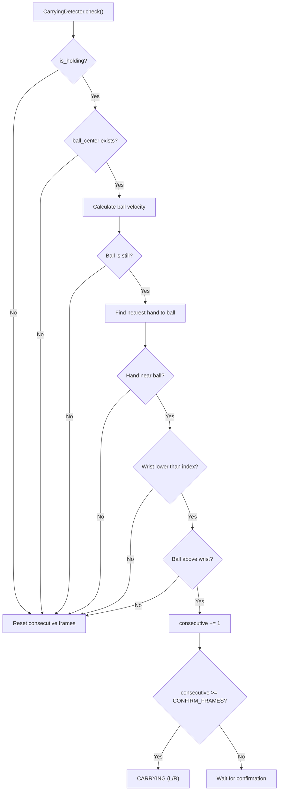

### Key idea

- Carrying ไม่ใช่แค่มืออยู่ใต้บอลในเฟรมเดียว
- ต้องใกล้บอลจริง
- บอลต้องช้าหรือหยุดในมือ
- ต้องเกิดหลายเฟรมติดกัน

---

## 10. Goaltending Flow

ตรวจ Goaltending เฉพาะเมื่อเห็น rim จริง

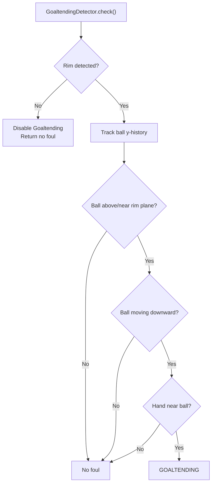

### Key idea

- ถ้า `best.pt` ยังตรวจ rim ไม่ดี ระบบจะไม่เดา goaltending
- วิธีนี้ลด false positive ตอนทดสอบในห้องหรือสนามที่ไม่เห็นห่วง

---

## 11. Held Ball / Jump Ball Flow

ตรวจสถานการณ์ลูกยึดตามกติกา

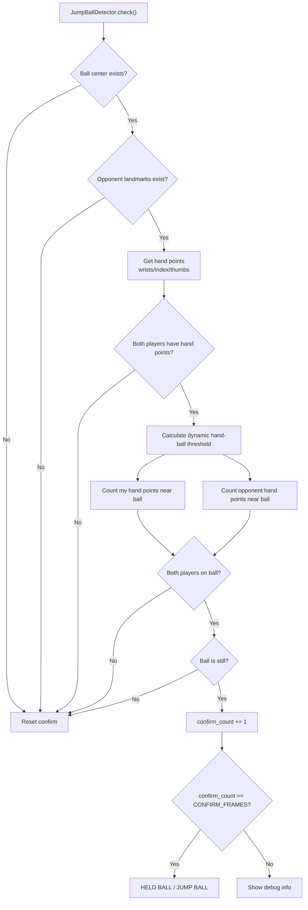

### Key idea

- ไม่ใช่ Push Foul
- ไม่ใช่ Illegal Hands
- ต้องมีผู้เล่นสองฝ่ายจับบอลหรือควบคุมบอลพร้อมกัน
- บอลต้องนิ่งหรือชะลอจริง
- ต้องยืนยันหลายเฟรม

---

## 12. Replay + Event Logging Flow

เมื่อตรวจพบ foul ระบบจะบันทึก replay และ log

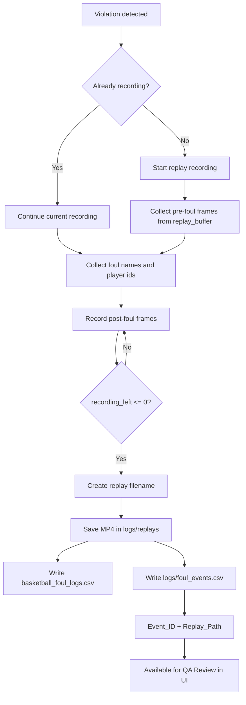

### ไฟล์ log ที่เกี่ยวข้อง

| File | Purpose |
|---|---|
| `basketball_foul_logs.csv` | log แบบเดิม ใช้ feed/analytics พื้นฐาน |
| `logs/foul_events.csv` | event log รุ่นใหม่ มี Event_ID + Replay_Path |
| `logs/review_labels.csv` | human QA review |
| `logs/runtime_status.json` | field test health แบบ real-time |
| `logs/replays/*.mp4` | replay video เมื่อเกิด foul |

---

## 13. QA Review + Accuracy Flow

ระบบไม่เรียก confidence ว่า accuracy แต่ใช้ human review เพื่อคำนวณ precision

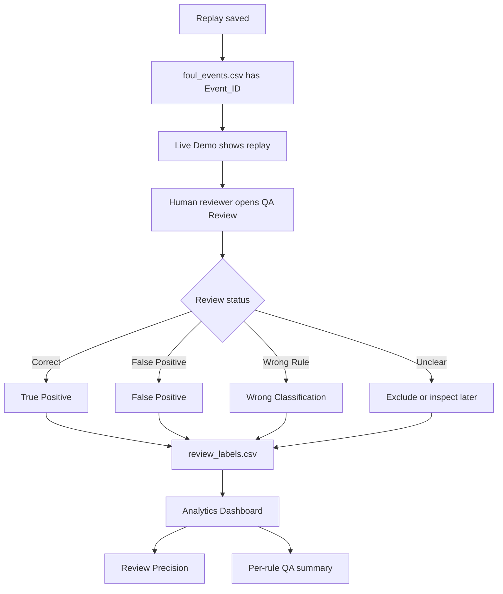

### Metric ที่ใช้ตอนนี้

```text
Review Precision = Correct / (Correct + False Positive + Wrong Rule)
```

หมายเหตุ:

- ยังไม่ใช่ Recall
- Recall ต้องมีการบันทึกจังหวะที่ AI พลาดไม่จับ foul
- ดังนั้นระบบปัจจุบันใช้ `Review Precision` ซึ่งถูกต้องกว่า `Accuracy %`

---

## 14. Runtime Status / Field Test Health Flow

ใช้ดูความพร้อมตอนเทสสนามจริง

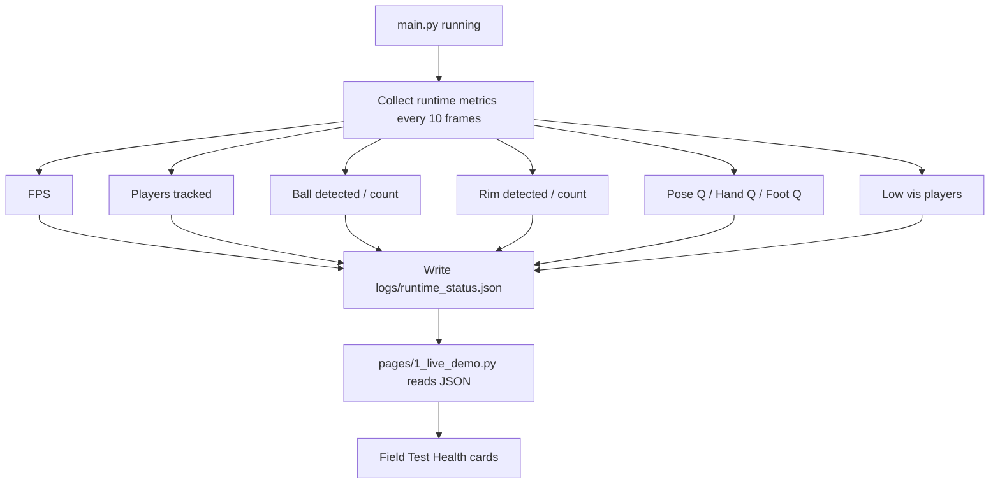

### วิธีอ่านค่าตอนเทสจริง

| UI Field | แปลว่า | ถ้าค่าต่ำควรทำอะไร |
|---|---|---|
| `FPS` | ความลื่นของระบบ | ลด imgsz หรือจำนวนผู้เล่น |
| `Players` | จำนวนผู้เล่นที่ YOLO track ได้ | ปรับมุมกล้องให้เห็นคนเต็มตัว |
| `Ball` | เห็นลูกบาสหรือไม่ | ขยับกล้อง / ปรับ model / ลดแสงสะท้อน |
| `Rim` | เห็นห่วงหรือไม่ | ถ้าไม่เห็น Goaltending จะถูก disable |
| `Pose Q` | คุณภาพ pose รวม | ถอยกล้องให้เห็นเต็มตัว |
| `Hand Q` | มือ/นิ้วชัดไหม | สำคัญกับ Carrying, Double Dribble, Held Ball |
| `Foot Q` | เท้า/เข่า/สะโพกชัดไหม | สำคัญกับ Traveling |
| `Low Vis` | จำนวนผู้เล่นที่ pose ไม่ชัด | ปรับมุมกล้องหรือแสง |

---

## 15. Streamlit UI Flow

Flow ของหน้า UI ในโฟลเดอร์ `pages`

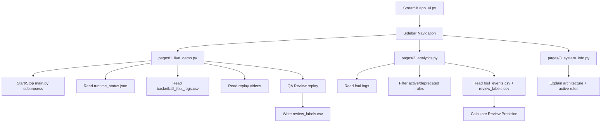

### Page responsibility

| Page | Responsibility |
|---|---|
| `pages/1_live_demo.py` | Start/stop system, Field Test Health, live foul feed, replay, QA review |
| `pages/2_analytics.py` | charts, active/deprecated filters, review precision |
| `pages/3_system_info.py` | architecture, rules, tech stack |

---

## 16. Data/File Flow

แสดงว่าแต่ละไฟล์ข้อมูลถูกสร้างและถูกอ่านตรงไหน

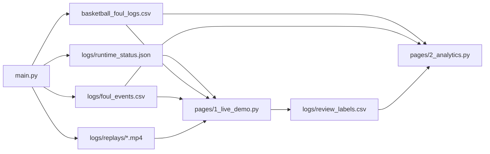

### สรุปข้อมูลแต่ละไฟล์

```text
basketball_foul_logs.csv
  - log ง่าย ๆ สำหรับ foul feed และสถิติเบื้องต้น

logs/foul_events.csv
  - event-level log
  - ผูก foul กับ replay path
  - ใช้กับ QA review

logs/review_labels.csv
  - มนุษย์รีวิวว่า event ถูกหรือผิด
  - ใช้คำนวณ Review Precision

logs/runtime_status.json
  - ค่าสุขภาพระบบแบบ real-time
  - ใช้ใน Live Demo / Field Test Health

logs/replays/*.mp4
  - วิดีโอ replay หลังเกิด foul
```

---

## 17. Field Test Checklist Flow

Flow สำหรับใช้เช็กก่อนเริ่มทดสอบสนามจริง

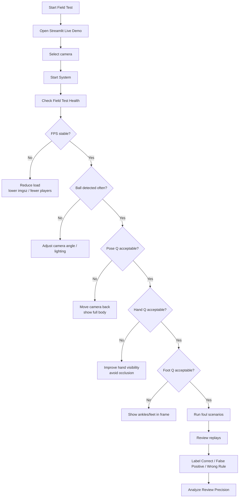

### Threshold แนะนำตอนเทส

```text
Pose Q >= 60%    = ใช้ได้
Hand Q >= 45%    = เริ่มเชื่อ hand-based rules ได้
Foot Q >= 50%    = เริ่มเชื่อ Traveling ได้
Ball = YES บ่อย  = ball detection ใช้ได้
Rim = YES เฉพาะเมื่อต้องทดสอบ Goaltending
```

---

## 18. Suggested Presentation Diagram

ถ้าจะวาดในสไลด์หรือ resume ให้ใช้ diagram แบบย่ออันนี้

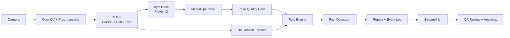

### Resume wording

```text
Built a real-time AI basketball referee pipeline using YOLOv8, ByteTrack,
MediaPipe Pose, OpenCV, and Streamlit. Designed a rule-based foul engine with
pose-quality gating, ball-motion tracking, replay-linked event logging, and
human QA review for precision analysis.
```

---

## 19. Current Active Rules Summary

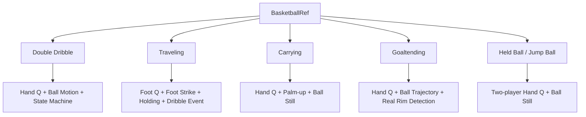

### Deprecated / Removed

```text
Contact Foul / 3D-CNN
Push Foul
Illegal Hands
```

ข้อมูลเก่าจาก deprecated rules ยังอาจอยู่ใน `basketball_foul_logs.csv` แต่ UI แยก active/deprecated แล้ว

---

## 20. How To Draw This Manually

ถ้าจะเอาไปวาดเองใน diagrams.net, Figma, Canva หรือ PowerPoint แนะนำใช้ 5 กล่องหลัก:

```text
1. Input
   Camera / Frame

2. Perception
   Preprocessor / YOLO / MediaPipe / Pose Quality

3. Reasoning
   BasketballRef / Rule Detectors / BallMotionTracker

4. Evidence
   Replay / Logs / Event_ID / Runtime Status

5. User Interface
   Live Demo / QA Review / Analytics
```

Flow ที่ควรวาด:

```text
Camera
  -> Preprocess
  -> YOLO + Pose
  -> Pose Quality + Ball Motion
  -> Rule Engine
  -> Violation
  -> Replay + Logs
  -> UI + Human Review
  -> Analytics
```

สีที่แนะนำ:

```text
Input         = Gray / Blue
AI Models     = Purple
Rule Engine   = Orange
Safety Gates  = Yellow
Logging       = Green
UI/Analytics  = Cyan
Violation     = Red
```

---

## 21. Final End-to-End Flow

Flow รวมแบบเข้าใจง่ายที่สุด

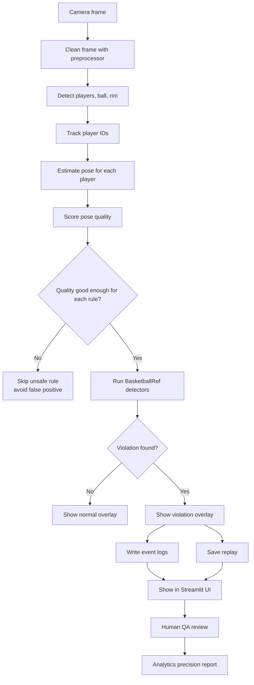

