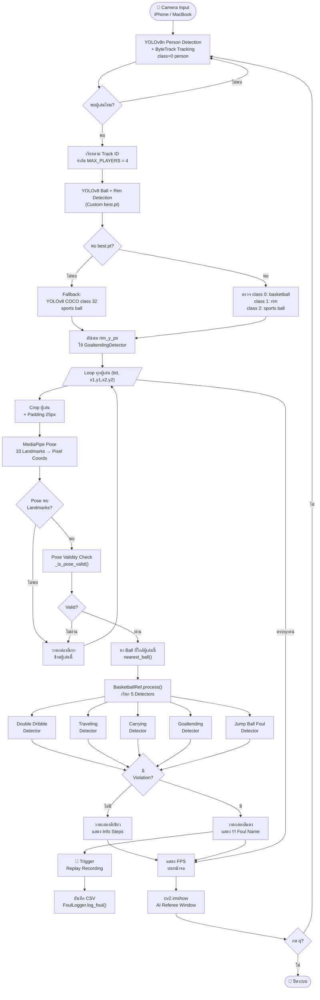
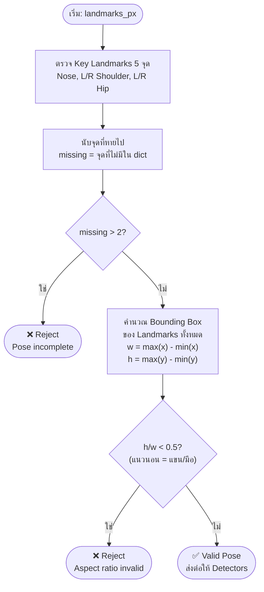
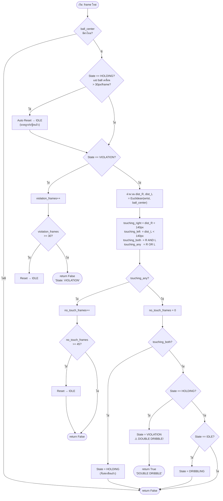
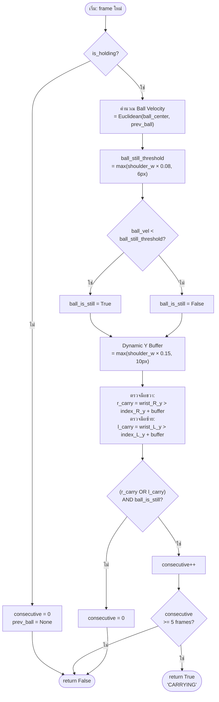
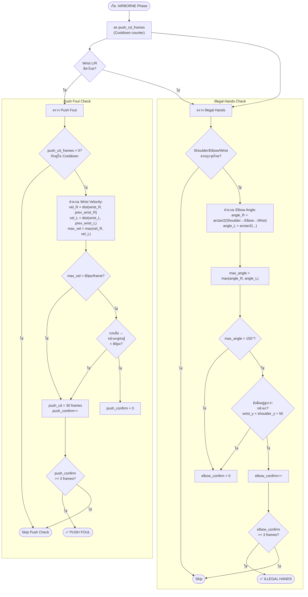
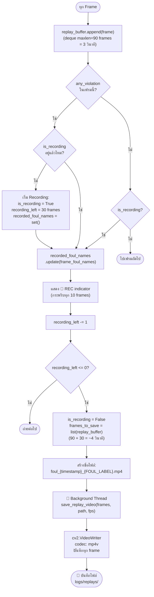
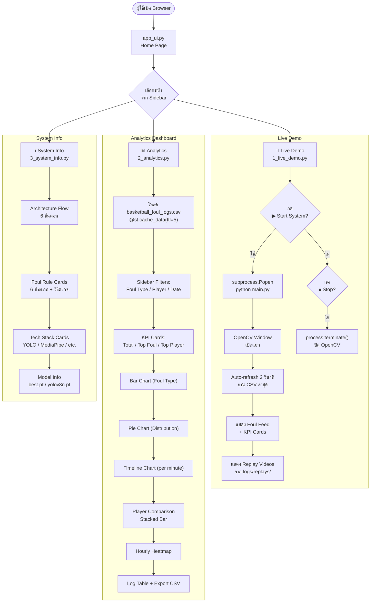

# System Flowcharts — AI Basketball Foul Detection

> Flowchart ทั้งหมดของระบบ วิเคราะห์จากซอร์สโค้ดจริง  
> เรนเดอร์ด้วย Mermaid (VS Code: ติดตั้ง "Markdown Preview Mermaid Support")

---

## Flowchart 1: Main System Pipeline (ภาพรวมทั้งระบบ)



---

## Flowchart 2: Pose Validity Check



---

## Flowchart 3: Double Dribble State Machine



---

## Flowchart 4: Traveling Detection

```mermaid
flowchart TD
    A([เริ่ม: frame ใหม่]) --> B["frame_n++"]
    B --> C{L/R Ankle\nมีค่าไหม?}
    C -- ไม่ --> Z(["return False\n'Steps: N'"])
    C -- มี --> D

    D["Kalman Filter 1D\nl_y = kf_l.update(ankle_L_y)\nr_y = kf_r.update(ankle_R_y)"]

    D --> E["Dynamic Lift Threshold\n= max(shoulder_width × 0.18, 12px)"]

    E --> F{"is_holding\nเพิ่งเปลี่ยน\nFalse → True?"}
    F -- ใช่ --> G["Gather Step Reset\nsteps = 0\ngather_left = 10\nReset FootStepTrackers"]
    G --> H
    F -- ไม่ --> H

    H{is_holding?}
    H -- ไม่ --> Z

    H -- ใช่ --> I{gather_left > 0?}
    I -- ใช่ --> J["gather_left--\nอัปเดต Kalman แต่ไม่นับก้าว"]
    J --> K(["return False\n'Steps: N [gather]'"])

    I -- ไม่ --> L

    L["FootStepTracker L: update(l_y, threshold)\nFootStepTracker R: update(r_y, threshold)"]

    L --> M{step_L เกิดขึ้น?\n(LIFTED → GROUNDED)}
    M -- ใช่ --> N{"frame_n - last_step\n> 2? (Jump Stop Check)"}
    N -- ใช่ --> O["steps += 1"]
    N -- ไม่ --> P["(Jump Stop: นับรวมกัน)"]
    O & P --> Q["last_step_frame = frame_n"]

    Q --> R{step_R เกิดขึ้น?}
    M -- ไม่ --> R

    R -- ใช่ --> S{"frame_n - last_step\n> 2?"}
    S -- ใช่ --> T["steps += 1"]
    S -- ไม่ --> U["(Jump Stop)"]
    T & U --> V["last_step_frame = frame_n"]

    R -- ไม่ --> V

    V --> W{steps > 2?}
    W -- ไม่ --> Z
    W -- ใช่ --> X["TemporalVoter.vote(True)\n(window=5, need 4/5)"]
    X --> Y{Vote\nConfirmed?}
    Y -- ไม่ --> Z
    Y -- ใช่ --> AA(["return True\n'TRAVELING (N steps)'"])
```

---

## Flowchart 5: Carrying Detection



---

## Flowchart 6: Goaltending Detection

```mermaid
flowchart TD
    A([เริ่ม: frame ใหม่]) --> B{ball_center\nมีค่าไหม?}
    B -- ไม่ --> C["Clear y_history"]
    C --> Z(["return False"])

    B -- มี --> D

    D["rim_y = rim_y_px\n(จาก YOLO หรือ fallback 42% height)"]
    D --> E["y_history.append(ball_y)\n(deque maxlen=15)"]

    E --> F{len(y_history)\n>= 8?}
    F -- ไม่ --> Z

    F -- ใช่ --> G{ball_y < rim_y?\n(บอลอยู่เหนือห่วง)}
    G -- ไม่ --> Z

    G -- ใช่ --> H

    H["np.polyfit(t, y_values, deg=2)\n→ สัมประสิทธิ์ (a, b, c)\ny = at² + bt + c"]

    H --> I{"a > 0.5?\n(พาราโบลาหงาย)\nAND y[-1] > y[-2]?\n(กำลังลง)"}
    I -- ไม่ --> Z

    I -- ใช่ --> J{มี hands_positions?}
    J -- ไม่ --> Z

    J -- ใช่ --> K["วัดระยะทุกมือ:\ndist = hypot(hand_x - ball_x,\n             hand_y - ball_y)"]
    K --> L{dist < 80px\nสำหรับมือใดมือหนึ่ง?}

    L -- ไม่ --> Z
    L -- ใช่ --> M["Clear y_history\n(ป้องกัน duplicate alert)"]
    M --> N(["return True\n'GOALTENDING ⚠️'"])
```

---

## Flowchart 7: Jump Ball Foul — Phase Detection

```mermaid
flowchart TD
    A([เริ่ม: frame ใหม่]) --> B{All Landmarks\nครบไหม?\nAnkle L/R, Hip L/R}
    B -- ไม่ --> Z(["return ไม่เปลี่ยน Phase"])

    B -- ใช่ --> C{Phase == IDLE?}
    C -- ใช่ --> D["เก็บ Baseline:\nl_ankle_baseline.append(ankle_L_y)\nr_ankle_baseline.append(ankle_R_y)\nhip_baseline.append(hip_y)"]
    D --> E
    C -- ไม่ --> E

    E{len(baseline)\n>= 20 frames?}
    E -- ไม่ --> Z

    E -- ใช่ --> F

    F["คำนวณ Baseline averages\nbase_l = mean(l_ankle_baseline)\nbase_r = mean(r_ankle_baseline)\nbase_hip = mean(hip_baseline)"]

    F --> G["คำนวณ Lift:\nlift_l = base_l - ankle_L_y\nlift_r = base_r - ankle_R_y\nhip_lift = base_hip - hip_y"]

    G --> H{"lift_l > 60px\nAND lift_r > 60px?\n(ทั้งสองเท้าลอย)"}
    H -- ไม่ --> I{"Phase ==\nAIRBORNE?"}
    I -- ใช่ --> J["Phase = LANDING"]
    I -- ไม่ --> K{"Phase ==\nLANDING?"}
    K -- ใช่ --> L["Phase = IDLE\nairborne_cnt = 0"]
    K -- ไม่ --> Z
    J & L --> Z

    H -- ใช่ --> M{"hip_lift > 36px?\n(60 × 0.6)"}
    M -- ไม่ --> I

    M -- ใช่ --> N["airborne_cnt++"]
    N --> O{airborne_cnt\n>= 5 frames?}
    O -- ไม่ --> Z
    O -- ใช่ --> P{"Phase !=\nAIRBORNE?"}
    P -- ใช่ --> Q["jump_count++"]
    Q --> R["Phase = AIRBORNE"]
    P -- ไม่ --> R
    R --> Z
```

---

## Flowchart 8: Jump Ball Foul — Foul Detection (Airborne Phase)



---

## Flowchart 9: Replay Recording System



---

## Flowchart 10: UI System (Streamlit)



---

## สรุป Flowchart ทั้งหมด

| # | Flowchart | ครอบคลุม |
|---|-----------|---------|
| 1 | **Main System Pipeline** | ภาพรวมทั้งระบบตั้งแต่กล้องถึง output |
| 2 | **Pose Validity Check** | กรอง detection ที่ไม่ใช่คน |
| 3 | **Double Dribble** | State Machine 4 สถานะ + auto-reset |
| 4 | **Traveling** | Kalman → FootStepTracker → TemporalVoter |
| 5 | **Carrying** | Palm position + Ball velocity check |
| 6 | **Goaltending** | Parabola fitting + Hand contact |
| 7 | **Jump Ball — Phase** | Baseline adaptive + IDLE/RISING/AIRBORNE/LANDING |
| 8 | **Jump Ball — Foul** | Push velocity + Elbow angle (Airborne only) |
| 9 | **Replay Recording** | Buffer → trigger → background save thread |
| 10 | **UI System** | Streamlit 3 หน้า + subprocess control |
